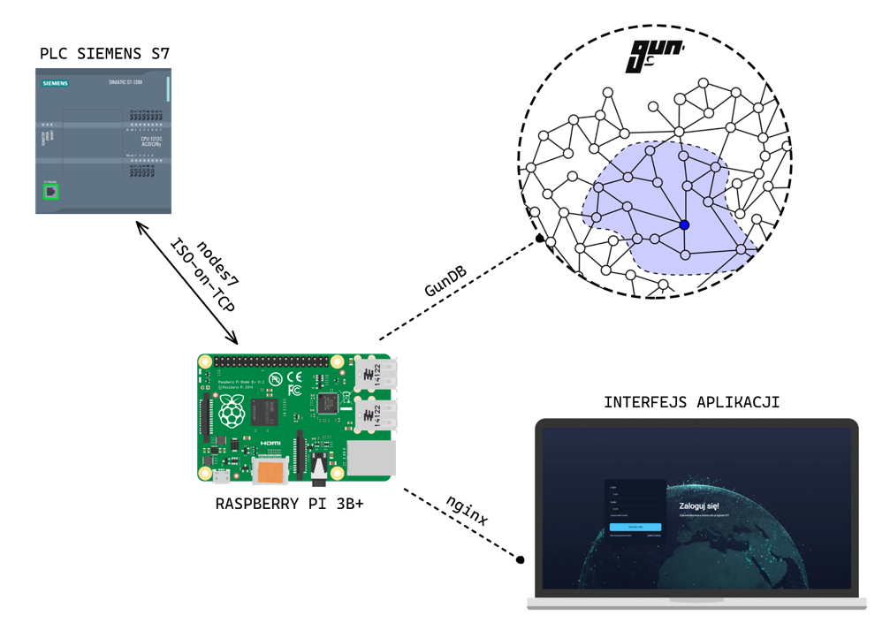

# Integration PLC's with the decentralized database


## Introduction
The next stage in the evolution of the Internet is coming. Web3 – a vision of an open web where we own the data. We can operate without subordinating ourselves to the websites of large corporations. So the idea was born to create an IOT gateway for industrial devices that uses a decentralized database. The use of such technology ensures greater data security.

## Connection



## Quickstart

### [Docker](https://www.docker.com/)

 > Warning: Docker image is community contributed and may be old with missing security updates, please check version numbers to compare.

[](https://hub.docker.com/r/gundb/gun/) [](https://microbadger.com/images/gundb/gun "Get your own image badge on microbadger.com") [](https://hub.docker.com/r/gundb/gun/) [](https://hub.docker.com/r/gundb/gun/)

``` bash
git clone https://github.com/orzelAr3k/decentralized-plc.git
cd decentralized-plc

docker-compose up -d
```


Then visit http://localhost in your browser.

